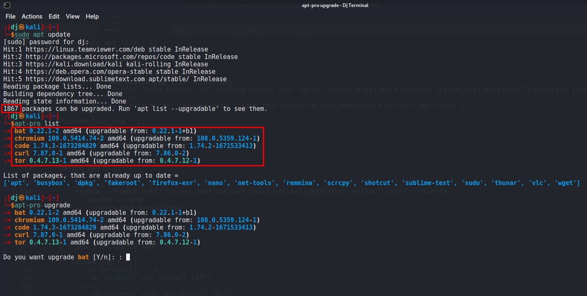
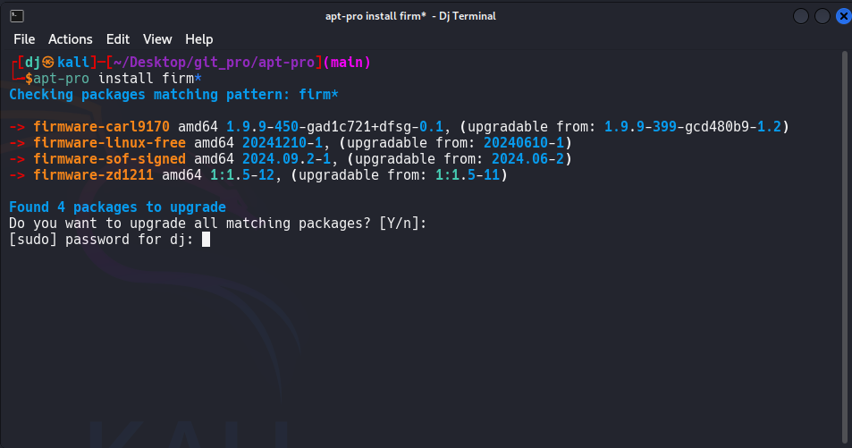

# 📦 apt-pro

A Python package for better update and manage your Debian packages.

[](https://github.com/jakbin/apt-pro/actions/workflows/publish.yml)
[](https://pypi.org/project/apt-pro)
[](https://pepy.tech/project/apt-pro)
[](https://pepy.tech/project/apt-pro)


## 🎯 Introduction

When you run `apt list --upgradable` in your terminal, you find around 1000 upgradable packages (if you are using Parrot OS or Kali Linux like distribution). It's hard to find your important package or security releases.  

For this solution, here is "apt-pro"! ✨

## ⭐ Features

- 🎯 **Custom Package List**: Maintain a personalized list of important packages you want to track
- 🔄 **Smart Upgrades**: 
  - Upgrade only your selected packages instead of all system packages
  - Resume interrupted upgrades automatically
  - Upgrade packages matching specific patterns (e.g., 'kali-*', 'xfce4-*')
- 📋 **Easy Management**:
  - Add or remove packages from your tracking list
  - View all upgradable packages from your list
  - Check which packages are up to date
- 🎨 **User-Friendly Interface**: 
  - Colorful and clear output
  - Interactive upgrade process with package-by-package confirmation
  - Clear status indicators for package states
- 💾 **Persistent Storage**: Uses SQLite database to remember your package list across sessions

## 🖥️ Demo



### ➕ Add and Remove Package from Your List


### 🔍 Upgrade Packages Matching a Pattern


## 🔧 Compatibility

Python 3.6+ is required.

## 📥 Installation

```sh
pip install apt-pro
```

or 

```sh
pip3 install apt-pro
```

## 🚀 Getting Started

```sh
apt-pro -h
```

## ✅ Todo-List

- [x] Pretty Output 
- [x] Update and upgrade packages from Here
- [x] Add or Remove packages from list
- [x] Use SQLite
