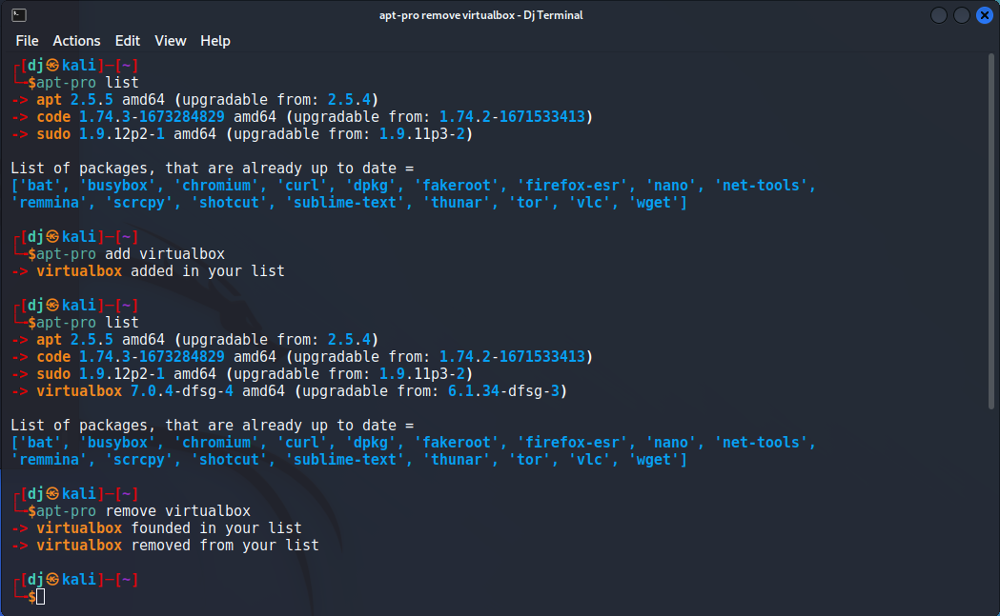

# 📦 apt-pro

A Python package for better update and manage your Debian packages. An smarter & interactive APT helper for Debian-based systems: maintain a custom watch list, resume interrupted upgrades, filter by patterns, explore dependencies/reverse deps, and upgrade with confidence

[](https://github.com/jakbin/apt-pro/actions/workflows/publish.yml)
[](https://pypi.org/project/apt-pro)
[](https://pepy.tech/project/apt-pro)
[](https://pepy.tech/project/apt-pro)


## 🎯 Introduction

Drowning in hundreds of upgradable packages? apt-pro lets you spotlight your critical ones, inspect their dependency graph, and upgrade them cleanly—without the noise.

When you run `apt list --upgradable` in your terminal, you find around 1000 upgradable packages (if you are using Parrot OS or Kali Linux like distribution). It's hard to find your important package or security releases.  

For this solution, here is "apt-pro"! ✨

## ⭐ Features

- 🎯 **Custom Package List**: Maintain a personalized list of important packages you want to track
- 🔄 **Smart Upgrades**: 
  - Upgrade only your selected packages instead of all system packages
  - Resume interrupted upgrades automatically
  - Upgrade packages matching specific patterns (e.g., 'kali-*', 'xfce4-*')
- 📋 **Easy Management**:
  - Add or remove packages from your tracking list
  - View all upgradable packages from your list
  - Check which packages are up to date
- 🎨 **User-Friendly Interface**: 
  - Colorful and clear output
  - Interactive upgrade process with package-by-package confirmation
  - Clear status indicators for package states
- 💾 **Persistent Storage**: Uses SQLite database to remember your package list across sessions

## 🖥️ Demo


### ➕ Add and Remove Package from Your List


### 🔍 Upgrade Packages Matching a Pattern


## 🔧 Compatibility

Python 3.6+ is required.

### 📋 Requirements

- Debian / Ubuntu / Kali / Parrot (any Debian-based distribution with APT)
- System package: `python3-apt` (usually preinstalled on Debian-based systems)
- Python package: `rich` (installed automatically as a dependency)
- APT tools available: `apt`, `apt-cache`
- (Recommended) sudo privileges for installing/upgrading system packages
- Internet access for fetching package metadata
- SQLite (bundled with Python stdlib) for persistent storage

If `python3-apt` is missing you can install it with:

```sh
sudo apt install python3-apt
```

## 📥 Installation

```sh
pip install apt-pro
```

or 

```sh
pip3 install apt-pro
```

## 🚀 Getting Started

```sh
apt-pro -h
```

## ✅ Todo-List

- [x] Pretty Output 
- [x] Update and upgrade packages from Here
- [x] Add or Remove packages from list
- [x] Use SQLite
